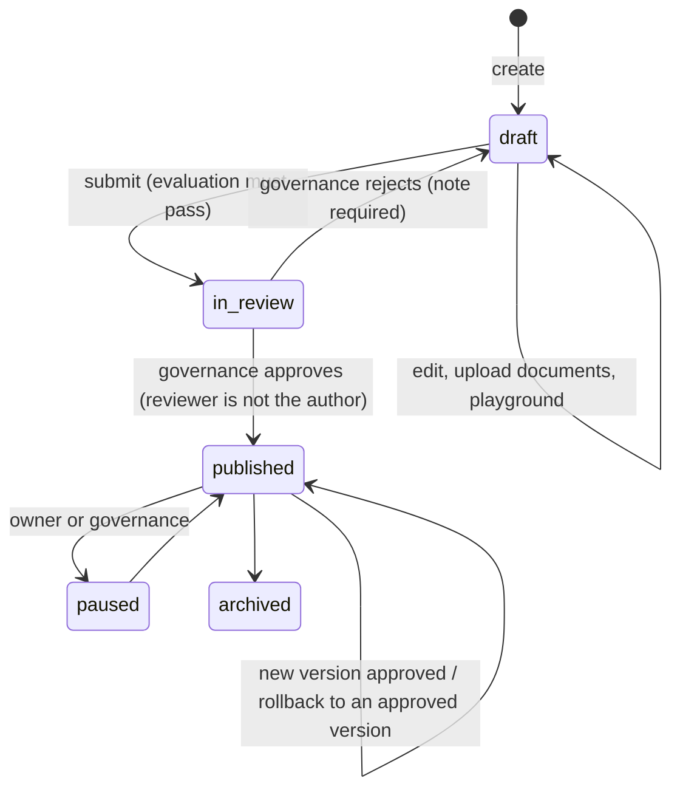

# Authoring agents

Two kinds of agents exist:

- **Built-in specialists** live in `shared/catalog/agents.yaml` and are seeded as published
  version 1. Engineers change them through pull requests.
- **Studio agents** are created by HR and business teams in the Agent Studio. They are
  *collective* agents (for a team, a unit or everyone), never personal assistants.

## What an agent is made of

| Field | Purpose |
|---|---|
| `name`, `description` | The description is what the router reads to decide when to call the agent. Be concrete about the questions it answers. |
| `instructions`, `tone` | System prompt for the agent. Common safety rules are appended automatically (`common_rules`). |
| `audience` | `all`, `roles` (`manager`, `hrbp`) or `units` (unit ids; sub-units included). Enforced by the router input filter and by RLS on the agent's knowledge. |
| `tools` | Chosen from the governed catalog (`shared/catalog/tools.yaml`). Each tool has a risk level: `read`, `write`, `sensitive`. Studio agents cannot use tools that act on other people (`subject: target`). |
| `knowledge` | Knowledge bases. Studio agents get their own base (`agente-<id>`), whose audience follows the agent. Uploads: Markdown, TXT, PDF, DOCX. |
| `routing.keywords`, `routing.examples` | Optional hints for the deterministic router (tests, demo). |
| `evaluation` | Golden questions: at least one `routing`, one `citation` and one `refusal`. |

## Lifecycle

- **Playground:** only the author can chat with a draft (`playground_agent`). Everybody
  else does not even see that it exists.
- **Evaluation gate:** `routing` checks that the router sends the question to this agent;
  `citation` runs the agent and requires a cited source (optionally from a given base);
  `refusal` requires that a request for someone else's data is refused.
- **Review:** a governance admin reviews tools (risk), audience, instructions and the
  evaluation report, and records a justification. Agents with `write`/`sensitive` tools are
  flagged as high risk.
- **Versioning:** editing a published agent creates a new draft version; the published one
  keeps serving until the new one is approved. Rollback re-publishes an approved version.
- **Periodic review:** every published agent has a review date (180 days by default).

## Metrics

Per agent: turns, people, resolution without a human, positive/negative feedback, cost, and
the **unanswered questions** list: questions where knowledge search found nothing. That
list is the content backlog for the team that owns the agent.

## Writing good instructions

- Say what the agent is for and what it is not for.
- Tell it to use the tools for numbers and dates and to cite sources for rules.
- Do not write security rules as instructions ("never show salaries"): security is enforced
  by tools, policies and the database. Instructions are about quality and tone.
