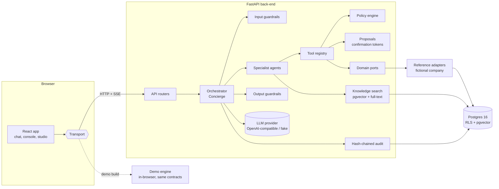

# Architecture

Atrium is a single conversational front door to everything an employee needs from the
company. A general-purpose corporate chat embeds company specialist agents; every tool
call is bound to the authenticated identity, authorized outside the model, and audited.

The product name is configured in `config/branding.json` and read by both the back-end and
the front-end. Nothing else hard-codes it.



## Repository layout

| Path | Contents |
|---|---|
| `config/branding.json` | Product name, tagline, fictional company name. Single source. |
| `shared/` | Cross-language contracts: agent catalog, tool catalog metadata, routing eval set, calculator test vectors, generated dataset and golden tool outputs consumed by the demo. |
| `content/kb/` | Knowledge base corpus (PT-BR, fictional) grouped by knowledge base id. |
| `backend/` | Python 3.12 package `atrium` (FastAPI, SQLAlchemy 2, Alembic, pytest). |
| `frontend/` | React + Vite + TypeScript + Tailwind app. One app, two transports (HTTP and Demo). |
| `deploy/` | Docker Compose (Postgres + API + web) and Dockerfiles. |
| `docs/` | Architecture, security model, connectors, agent authoring, ADRs, screenshots. |

## Back-end modules (`backend/atrium`)

| Module | Responsibility |
|---|---|
| `config.py` | Settings from environment (`ATRIUM_*`, `OPENROUTER_*`, `LLM_*`). |
| `clock.py` | Business clock. `ATRIUM_TODAY` pins "today" (reference dataset uses 2026-10-01). |
| `calculators/` | Pure, deterministic functions: holidays, vacation rules and window optimizer, INSS, IRRF (with the Lei 15.270 reduction), 13th salary, vacation pay, payslip, annual projection, PGBL. Tables are versioned by validity date and cite their source. |
| `domain/` | Pydantic models of the HR domain (employee, vacation period, payslip, plan...). |
| `ports/` | Protocols per domain: `DirectoryProvider`, `VacationProvider`, `PayrollProvider`, `BenefitsProvider`, `TimeTrackingProvider`, `ReimbursementProvider`, `DocumentsProvider`, `ProfileProvider`, `CareerProvider`, `OnboardingProvider`, `TicketingProvider`, `AnalyticsProvider`. |
| `adapters/reference/` | SQL adapters over the `hr` schema of the fictional company. Every query runs inside an RLS-scoped transaction. |
| `seed/` | Deterministic generator of the fictional company (about 120 people) and loader. Also exports `shared/generated/dataset.json` for the demo. |
| `authz/` | `IdentityContext`, policy engine (`authorize(ctx, action, subject)`), configurable policies, k-anonymity helpers. |
| `db/` | Engine, session factory that sets `app.employee_id` with `SET LOCAL`, ORM models of the `app` schema, Alembic migrations (including RLS policies). |
| `runtime/` | Agent runtime: `Tool`, `ToolRegistry`, `Agent`, `Orchestrator`, `Guardrail` pipeline, `ProposalService`, `AuditLog`, LLM providers (`OpenAICompatibleProvider`, `FakeProvider`), streaming events. |
| `tools/` | Tool implementations per domain. Self-service tools have no subject parameter. |
| `agents/` | Loader for the built-in catalog (`shared/catalog/agents.yaml`) plus Agent Studio definitions stored in the database. |
| `kb/` | Ingestion (Markdown, PDF, DOCX, TXT), heading-aware chunking, embedders (fastembed and deterministic hash), hybrid search with reciprocal rank fusion, citations. |
| `pdf/` | WeasyPrint templates for payslips and letters (embedded fonts). |
| `api/` | Routers: `auth`, `chat` (SSE), `conversations`, `proposals`, `documents`, `uploads`, `console`, `studio`, `kb`. |

## Request lifecycle (one chat turn)

1. **Authenticate.** A bearer token (dev IdP JWT or OIDC) is verified. The `sub`/email is
   resolved through the `DirectoryProvider` into an `IdentityContext`: employee id, unit,
   manager chain, direct reports, HRBP scope, platform roles, step-up timestamp. Roles come
   from the system of record, not from the prompt and not from client input.
2. **Rate limit and budget.** Per-user message rate and daily token budget (policy).
3. **Input guardrails.** PII detection (masked for storage), DLP for secrets and bulk
   customer data (warn or block by policy), blocked topics, prompt-injection heuristics,
   sensitive-topic detection (harassment, whistleblowing, mental health) which forces a
   careful hand-off to the Policies & Compliance agent with minimal retention.
4. **Routing.** The Concierge receives only the agents visible to this identity (audience
   filter: everyone, managers, specific units; drafts only for their author in the
   playground). It returns a routing decision: one specialist, several specialists (life
   event), clarification, direct answer, or hand-off to a human. With a real model this is
   a tool call whose `agent` enum contains only visible agents; with the fake model it is a
   deterministic lexical router over the same routing profiles. An agent the user cannot
   see cannot be routed to: the enum does not contain it and the runtime re-checks.
5. **Specialist loop.** Each selected specialist runs a bounded tool loop (max 6 steps)
   with its instructions, the identity summary, and its tools plus `kb_search` restricted
   to its knowledge bases. Tool results are wrapped as untrusted data.
6. **Tool execution.** The registry validates arguments against the tool schema, injects
   the subject from the identity (self-service tools) or asks the policy engine to decide
   on the requested target (manager/HR tools), runs the handler inside an RLS-scoped
   transaction, and records an audit event with the authorization decision. Write tools
   never execute here: they return a `ToolProposal`.
7. **Composition.** Single specialist: its final answer streams to the client. Multiple
   specialists: the Concierge composes one answer from their results.
8. **Output guardrails.** Third-party data leak check (names and values of people the
   user was not authorized for), number grounding (amounts must come from tool results or
   cited sources), PII masking for the stored copy.
9. **Persist and audit.** Message, routing, tool calls, guardrail outcomes and usage are
   stored and appended to the hash chain.

Writes complete in a separate request: the user clicks Confirm on the proposal card,
`POST /api/proposals/{id}/confirm` verifies the token (owner, single use, expiry, step-up
for sensitive actions), re-authorizes, executes, and audits.

## Core runtime concepts

```python
class Risk(StrEnum): READ = "read"; WRITE = "write"; SENSITIVE = "sensitive"

@dataclass(frozen=True)
class IdentityContext:
    employee_id: str; name: str; email: str; unit_id: str; unit_path: list[str]
    roles: frozenset[str]          # employee, manager, hrbp, governance_admin, agent_author
    manager_id: str | None; direct_reports: frozenset[str]; chain_reports: frozenset[str]
    hrbp_units: frozenset[str]     # unit ids (subtree roots) the HRBP covers
    location: str; step_up_at: datetime | None; session_id: str; request_id: str

class Tool:                       # registered with @tool(...)
    name: str                     # snake_case, OpenAI-compatible function name
    domain: str; title: str; description: str
    risk: Risk                    # write/sensitive tools return proposals
    params: type[BaseModel]       # JSON schema sent to the model
    subject: Literal["self", "target", "none"]  # "self" tools have no subject parameter
    required_roles: frozenset[str]
    handler: Callable[[ToolContext, BaseModel], ToolResult]
    executor: Callable[[ToolContext, dict], ToolResult] | None  # only for write/sensitive

@dataclass
class ToolResult:
    data: dict                    # what the model sees (minimal, already authorized)
    card: Card | None             # generative UI payload for the client
    summary: str                  # deterministic PT-BR narration (used by the fake model)
    citations: list[Citation]
    proposal: ToolProposal | None
```

A `ToolContext` carries the identity, the providers (ports), the policy engine, the clock
and a reference to the audit log. Handlers never receive raw database sessions; providers
do, through the RLS-scoped session.

## Streaming contract (SSE)

`POST /api/chat` streams `text/event-stream`. Each event is `event: <type>` +
`data: <json>`. The demo transport emits the exact same sequence.

| Event | Payload |
|---|---|
| `message.start` | `{conversation_id, message_id}` |
| `trace.guardrail` | `{stage: input/output, name, outcome: pass/warn/mask/block, detail}` |
| `trace.route` | `{agents: [{id, name}], mode: single/multi/clarify/direct/handoff, reason, method: llm/lexical, life_event?}` |
| `agent.start` | `{agent_id, agent_name}` |
| `trace.tool` | `{agent_id, tool, risk, args, decision: {allowed, reason, policy}, status, duration_ms}` |
| `trace.authz` | `{subject, subject_name, action, decision}` — pre-routing subject check when a message asks for a named colleague's data |
| `suggestions` | `{items: [string]}` — quick replies (clarification options) |
| `card` | `{agent_id, card: {type, data}}` |
| `citation` | `{id, kb, document, section, snippet, url}` |
| `proposal` | `{id, token, tool, summary, details, risk, step_up_required, expires_at}` |
| `text.delta` | `{delta}` |
| `usage` | `{model, prompt_tokens, completion_tokens, cost_usd}` |
| `message.end` | `{message_id, resolved: bool}` |
| `error` | `{code, message}` |

The confirmation token travels only to the user's client. The model is told that a
proposal exists and is awaiting the user; it never sees the token.

## Data model

Two Postgres schemas, owned by the migration role `atrium_owner`. The API connects as
`atrium_app`, which has no `BYPASSRLS` and only the grants it needs.

- `hr` — the fictional company's systems of record (directory, compensation, payslips,
  vacation periods and requests, time bank, benefits, dependents, bank accounts,
  reimbursements, trainings, jobs, onboarding, absences). Row-level security on every
  table holding personal data, derived from a single session variable
  (`app.employee_id`): the database computes the manager chain and HRBP scope itself.
- `app` — platform data: conversations and messages (RLS: owner only, or an audited
  transcript grant), proposals, audit events (insert-only, hash chained), agents and
  versions, evaluations, knowledge bases, documents and chunks (`vector(384)` +
  `tsvector`), policies, usage, feedback, tickets.

## Agent catalog

Built-in agents live in `shared/catalog/agents.yaml` (instructions, routing profile with
keywords and example utterances, tools, knowledge bases, audience). The catalog is loaded
by the back-end at startup and seeded as published versions; Agent Studio agents live only
in the database with the same spec shape. Life-event playbooks (`shared/catalog/life_events.yaml`)
declare which specialists and tools participate in each event.

| Id | Agent | Audience |
|---|---|---|
| `concierge` | Concierge (orchestrator) | everyone |
| `vacation` | Férias e Ausências | everyone |
| `payroll` | Remuneração e Folha | everyone |
| `benefits` | Benefícios | everyone |
| `reimbursement` | Reembolsos e Despesas | everyone |
| `timekeeping` | Ponto e Jornada | everyone |
| `documents` | Documentos e Declarações | everyone |
| `profile` | Dados Cadastrais | everyone |
| `career` | Carreira e Desenvolvimento | everyone |
| `onboarding` | Onboarding | everyone (prioritized for new hires) |
| `leadership` | Liderança | managers |
| `people_analytics` | People Analytics | HRBPs |
| `compliance` | Políticas e Compliance | everyone |
| `data_platform` | Plataforma de Dados (created in Agent Studio) | unit Plataforma de Dados |

## LLM providers

`LLMProvider.complete(messages, tools, max_tokens, stream) -> Completion` with two
implementations:

- `OpenAICompatibleProvider` — any OpenAI-compatible endpoint (OpenRouter, Azure OpenAI,
  vLLM, Ollama). Configured by `LLM_BASE_URL`, `LLM_API_KEY`, `LLM_MODEL`; defaults read
  `OPENROUTER_API_KEY` and `OPENROUTER_MODEL`. Always sends `max_tokens`.
- `FakeProvider` — deterministic and scriptable. Routes with the lexical router, picks
  tools by their routing hints, extracts arguments with small parsers (dates, amounts,
  months), and answers with each tool's deterministic `summary`. Tests can also script
  exact responses (for example to simulate a model that hallucinates a number).

Tests never call a real model. `make smoke-live` runs a handful of real conversations with
a hard cost cap.

## Front-end

React + Vite + TypeScript + Tailwind, fonts self-hosted with `@fontsource`, icons from
`lucide-react`. A `Transport` interface (`listPersonas`, `login`, `sendMessage` returning
an async iterator of stream events, `confirmProposal`, conversations, console and studio
calls) has two implementations:

- `HttpTransport` — the real back-end.
- `DemoTransport` — an in-browser engine built when `VITE_DEMO=1`, using the generated
  dataset, a TypeScript port of the calculators, policy engine and tools, MiniSearch over
  pre-chunked knowledge, and `pdf-lib` for client-side PDFs. Parity with the back-end is
  enforced by golden fixtures generated by the Python implementation
  (`shared/generated/goldens.json`) and asserted by Vitest.

## Demo build and publication

`npm run build:demo` produces a static site with a configurable Vite `base`
(`VITE_BASE`). The GitHub Pages workflow derives it from the repository name
(`/${{ github.event.repository.name }}/`).
